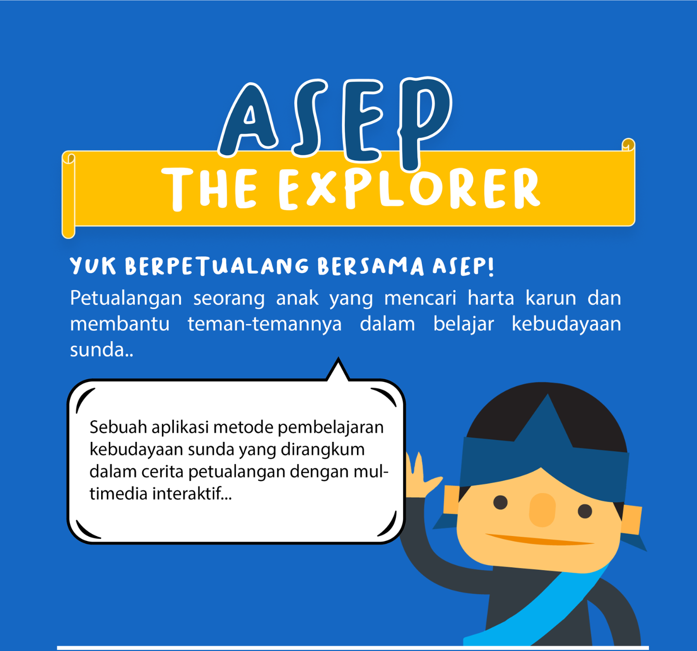
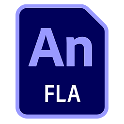

# Asep the Explorer

**Asep the Explorer** adalah aplikasi multimedia interaktif berbasis **Adobe Animate** yang dirancang sebagai media pembelajaran untuk mengenalkan kebudayaan Sunda dalam **Bahasa Indonesia**. Melalui perpaduan cerita, kuis, mini-games, serta audio-visual, aplikasi ini menghadirkan pengalaman belajar yang menyenangkan sekaligus mendidik. Proyek ini ditujukan untuk mendukung muatan lokal di sekolah maupun sebagai media edukasi umum untuk masyarakat luas.

---

    

## Unduh & Coba

<h3>Asep the Explorer.apk</h3>
  

## Pengembangan Lanjutan

<h3>Asep the Explorer.fla</h3>
  

---

## Fitur Utama

- **Cerita Interaktif**: Tokoh Asep berpetualang mencari pusaka kujang.
- **Kuis Edukatif**: Pertanyaan seputar sejarah, kesenian, makanan, dan tradisi Sunda.
- **Mini Games**: Drag & drop makanan tradisional, mencocokkan alat musik, pakaian adat, dll.
- **Sistem Reward**: Pemain akan memperoleh **reward** sebagai simbol pencapaian.  
  Jenis reward yang diterima berbeda-beda, menyesuaikan total poin yang berhasil dikumpulkan sepanjang permainan (kuis & mini-games).

---

## Cara Menjalankan

- **Versi Android (.apk)**  
  Untuk mencoba aplikasi di smartphone, cukup unduh file `Asep the Explorer.apk`, kemudian instal di perangkat Android Anda.  
  Jangan lupa aktifkan opsi _Install from Unknown Sources_ pada pengaturan keamanan. Setelah terpasang, aplikasi bisa langsung dijalankan.

- **Versi Proyek (.fla)**  
  Jika ingin melihat atau mengembangkan aplikasi lebih lanjut, unduh lalu buka file `Asep the Explorer.fla` dengan Adobe Animate.  
  Dari sini Anda bisa memodifikasi semua aset dan timeline untuk pengembangan lebih lanjut.

---

## Preview

---

## Lisensi

- **Kode & file proyek (.fla)** → [MIT License](LICENSE)
- **Aset media (gambar, audio, video)** → digunakan untuk tujuan edukasi & non-komersial.  
  Beberapa aset bukan karya asli, sebagian sumber sudah tidak terdokumentasi dengan baik.

👉 Jika Anda pemilik salah satu aset dan ingin disebutkan secara khusus atau dihapus, silakan hubungi saya.
